# Realme-Website

1.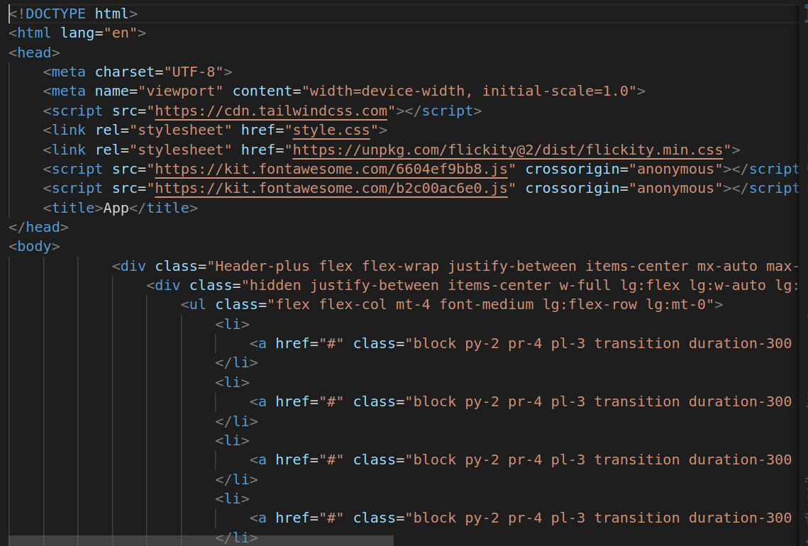

2.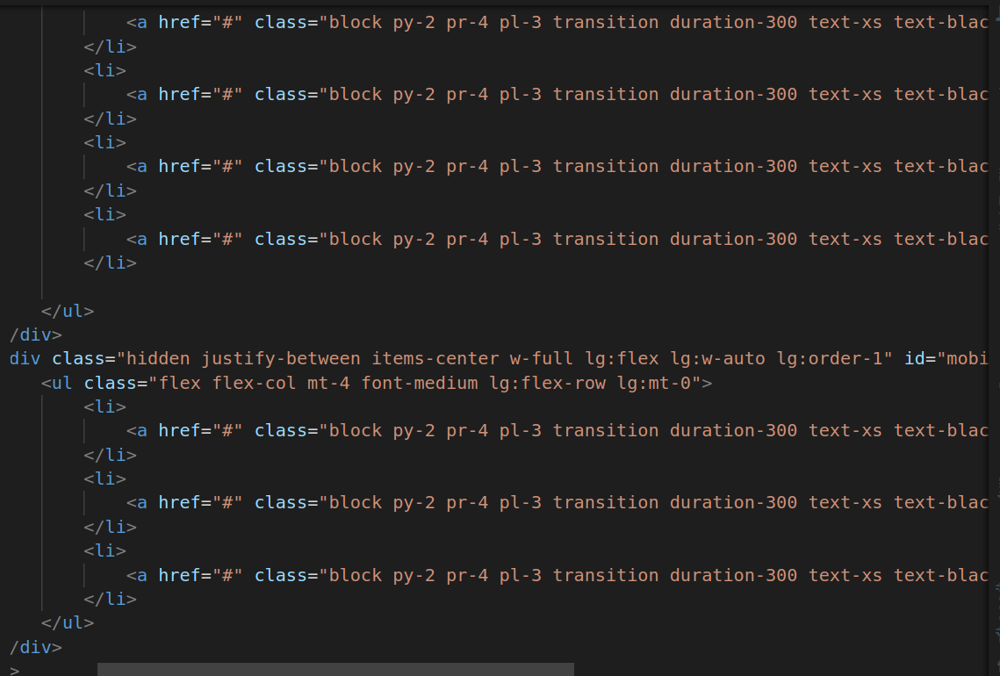

3.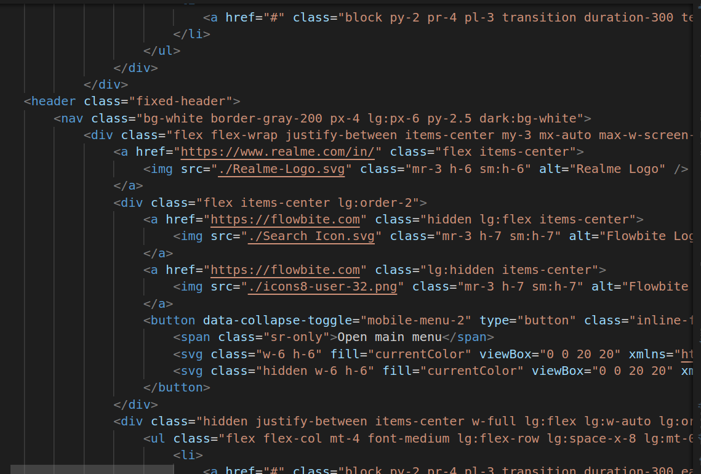

4.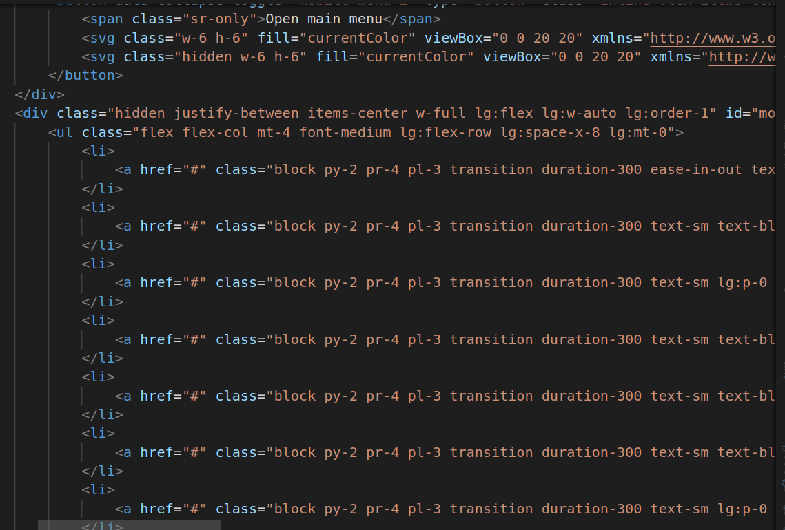

* !DOCTYPE html:This is the document type declaration and defines the document to be HTML5.
* html lang="en":This is the root element of the HTML document, and it sets the document's language to English.
* head:The head section contains metadata about the document, such as character encoding and the document's title.
* meta charset="UTF-8":Specifies the character encoding for the document as UTF-8, which is commonly used for web pages.
* meta name="viewport" content="width=device-width, initial-scale=1.0":This meta tag sets the viewport properties, ensuring that the page's width matches the device width and scales appropriately for mobile devices.
* script src="https://cdn.tailwindcss.com":Loads the Tailwind CSS framework from a CDN (Content Delivery Network).
* link rel="stylesheet" href="style.css":Links an external CSS file named "style.css" to apply additional styling to the HTML content.
* link rel="stylesheet" href="https://unpkg.com/flickity@2/dist/flickity.min.css":
Links an external CSS file for the Flickity slider library, used for carousel functionality.
* script src="https://kit.fontawesome.com/6604ef9bb8.js" crossorigin="anonymous":Includes the Font Awesome icon library for icons in the web page.
* script src="https://kit.fontawesome.com/b2c00ac6e0.js" crossorigin="anonymous":Includes another Font Awesome kit for additional icons.
* title:Sets the title of the web page, which appears in the browser's title bar or tab.
* body:The body element contains the visible content of the web page.
* div class="Header-plus flex flex-wrap justify-between items-center mx-auto max-w-screen-xl":
This is a top-level div element with a class that contains the header section of your webpage. It uses Flexbox for layout and is responsive (max-w-screen-xl limits its maximum width).
* div class="hidden justify-between items-center w-full lg:flex lg:w-auto lg:order-1 my-2" id="mobile-menu-2:This is a sub-division within the header for the mobile menu when the screen size is large (lg). It contains a list of navigation items and uses Flexbox for layout. It's hidden by default.
* ul class="flex flex-col mt-4 font-medium lg:flex-row lg:mt-0":This is an unordered list (ul) for navigation items. In this case, it's a vertical list on smaller screens and horizontal on larger screens.
* li (Repeated):These are list items (li) within the navigation menu. Each item contains a link to a different page or section of the website.
* div class="fixed-header":This division represents the fixed header section of the webpage. It contains navigation links and is always visible at the top of the page when scrolling.
* nav class="bg-white border-gray-200 px-4 lg:px-6 py-2.5 dark:bg-white":This is the navigation bar within the fixed header. It has a white background and uses various CSS classes for styling.
* div class="flex flex-wrap justify-between items-center my-3 mx-auto max-w-screen-xl":This division represents the container for the navigation bar content. It uses Flexbox for layout.
* a class="flex items-center":This is a link (anchor) to the realme website with a logo image inside.
* div class="flex items-center lg:order-2":This division contains elements on the right side of the navigation bar, such as search and user icons.
* button data-collapse-toggle="mobile-menu-2" type="button" class="inline-flex items-center p-2 ml-1 text-sm text-gray-500 rounded-lg lg:hidden hover:bg-gray-100 focus:outline-none focus:ring-2 focus:ring-gray-200 dark:text-gray-400 dark:hover:bg-gray-700 dark:focus:ring-gray-600" aria-controls="mobile-menu-2" aria-expanded="false":
* This is a button that toggles the mobile menu on small screens. It's hidden on larger screens.
* div class="hidden justify-between items-center w-full lg:flex lg:w-auto lg:order-1 my-2" id="mobile-menu-2":This is the mobile menu (hidden by default) that appears when the mobile menu button is clicked on small screens.
* ul class="flex flex-col mt-4 font-medium lg:flex-row lg:mt-0":This unordered list (ul) is part of the mobile menu. It contains navigation items that are stacked vertically on smaller screens and displayed horizontally on larger screens (thanks to the CSS classes flex-col and lg:flex-row).
* li (Repeated):These list items (li) are within the mobile menu and represent individual navigation links.
* div class="flex items-center justify-between lg:hidden":This division contains elements that appear on the left side of the navigation bar when the screen size is small (lg:hidden).
* a href="/" class="text-lg font-semibold leading-none text-black":This is a link to the homepage (represented by "/") with a large, bold, and black text as the site title or logo.
* div class="flex items-center justify-between lg:hidden":
* This division contains elements that appear on the right side of the navigation bar when the screen size is small (lg:hidden).
* a href="#" class="text-gray-600 dark:text-gray-400":
This is a link to an unspecified location (href="#") with gray text color, typically used for icons or buttons.
* i class="fas fa-search text-lg":This is an icon for a search feature, represented using the i element and the Font Awesome class.
* i class="fas fa-user text-lg">:This is an icon representing a user profile or account, also using Font Awesome.
* div class="search-box":This division represents a search box section of your webpage.
* input type="text" id="search" placeholder="Search" class="bg-transparent border-none focus:ring-0 dark:bg-transparent":This is an input field for entering search queries, with a placeholder text "Search."
* button type="button" class="text-gray-400 hover:text-gray-700 dark:text-gray-500 dark:hover:text-gray-300 focus:outline-none focus:text-gray-600 dark:focus:text-gray-400":This is a button for submitting search queries.
* div class="pt-10":This division appears after the header section and has padding at the top (pt-10), creating space between the header and the content.
* section class="grid grid-cols-1 gap-6 lg:grid-cols-2 xl:grid-cols-3":This section contains a grid layout with one column on small screens, two columns on large screens (lg:grid-cols-2), and three columns on extra-large screens (xl:grid-cols-3).
* article (Repeated):These are individual articles within the grid layout. Each article represents a distinct piece of content.
* div class="bg-white dark:bg-gray-900 rounded-lg shadow-lg":
* This division contains the content of each article, which is styled with a white background, rounded corners, and a shadow.
* a href="#":This is a link within each article. The href attribute is set to "#" (unspecified) but typically would link to the full article.
* img src="image.jpg" alt="Image description" class="object-cover w-full h-48 rounded-t-lg":
An image with a source ("image.jpg") and alternative text ("Image description"). It takes the full width of its container, has a fixed height, and rounded top corners (rounded-t-lg).
* div class="p-6">:This division contains the content of each article, with padding on all sides (p-6).
* h2 class="text-lg font-semibold text-gray-800 dark:text-gray-100":This is a heading element (<h2>) with a medium font weight, gray text color, and dark mode styling.
* p class="mt-4 text-gray-600 dark:text-gray-400">:
* A paragraph element  with gray text color (dark mode styling) and top margin (mt-4).
* div class="flex mt-4":This is a division element with a top margin of 4 units (mt-4) and a flex layout (flex). The purpose of this division may be to arrange its child elements in a flexible manner.
* img class="h-10 w-10 rounded-full" src="profile.jpg" alt="Profile Picture":This is an img element representing an image, likely a profile picture. It has styling applied to it, such as a height and width of 10 units (h-10 w-10) and rounded corners (rounded-full). The src attribute specifies the image source file ("profile.jpg"), and the alt attribute provides alternative text for the image.
* div class="ml-2":This is a division element with a left margin of 2 units (ml-2). It's used to create space or separation between this element and its adjacent elements.
* h2 class="text-lg font-semibold">John Doe:This is an h2 element containing text content ("John Doe"). It's styled with a large font size for text (text-lg) and a semi-bold font weight (font-semibold). Typically,h2 elements are used for headings.
* p class="text-gray-600",Front-end Developer:
This is a p element containing text content ("Front-end Developer"). It's styled with gray text color (text-gray-600). This paragraph appears to describe the occupation or role of "John Doe."
* p class="text-gray-600">Passionate about web development and design.:
This is another p element containing text content ("Passionate about web development and design."). Like the previous paragraph, it's styled with gray text color (text-gray-600). This paragraph likely provides additional information about John Doe's interests or expertise.
* div class="flex space-x-2 mt-4":This division contains a flex layout (flex) with space between child elements (space-x-2) and a top margin of 4 units (mt-4).
* a href="#" class="text-gray-400 hover:text-gray-500",class="fab fa-facebook":
* This is an anchor element represented as a text link. The href attribute is set to "#" (a placeholder URL). It's styled with gray text color (text-gray-400) that changes to a slightly different shade when hovered over (hover:text-gray-500). Inside the anchor element, there's an icon represented by an  element with the class "fab fa-facebook," which suggests that it's a Facebook icon.
* a href="#" class="text-gray-400 hover:text-gray-500", class="fab fa-twitter">:
This is similar to the previous anchor element, but it contains a Twitter icon represented by an element with the class "fab fa-twitter."
* a href="#" class="text-gray-400 hover:text-gray-500":
Likewise, this is another anchor element with a LinkedIn icon represented by an  element with the class "fab fa-linkedin."
* a href="#" class="text-gray-400 hover:text-gray-500":
This is another anchor element, but it contains a GitHub icon represented by an i element with the class "fab fa-github."

5.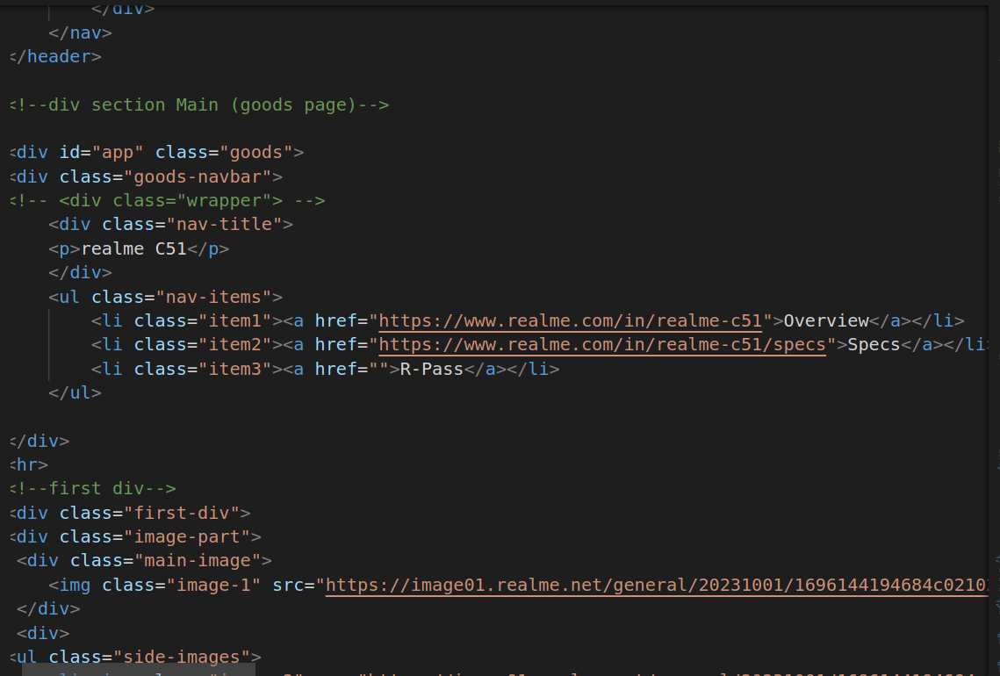

6.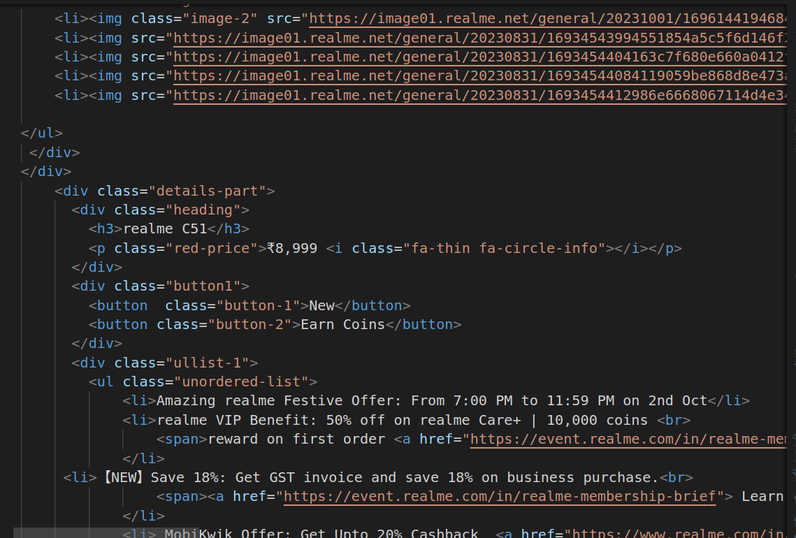

7.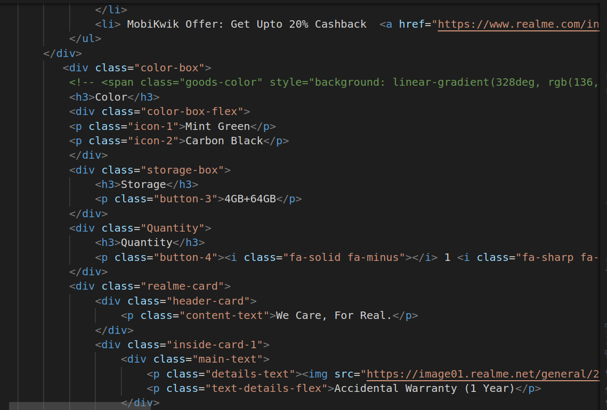

8.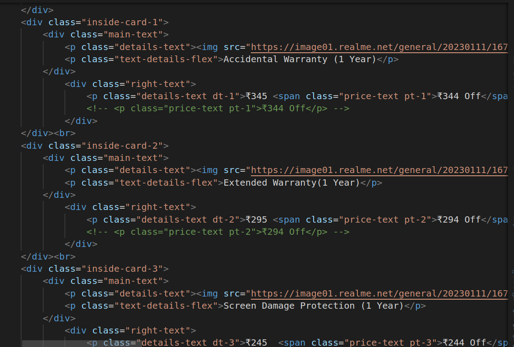

9.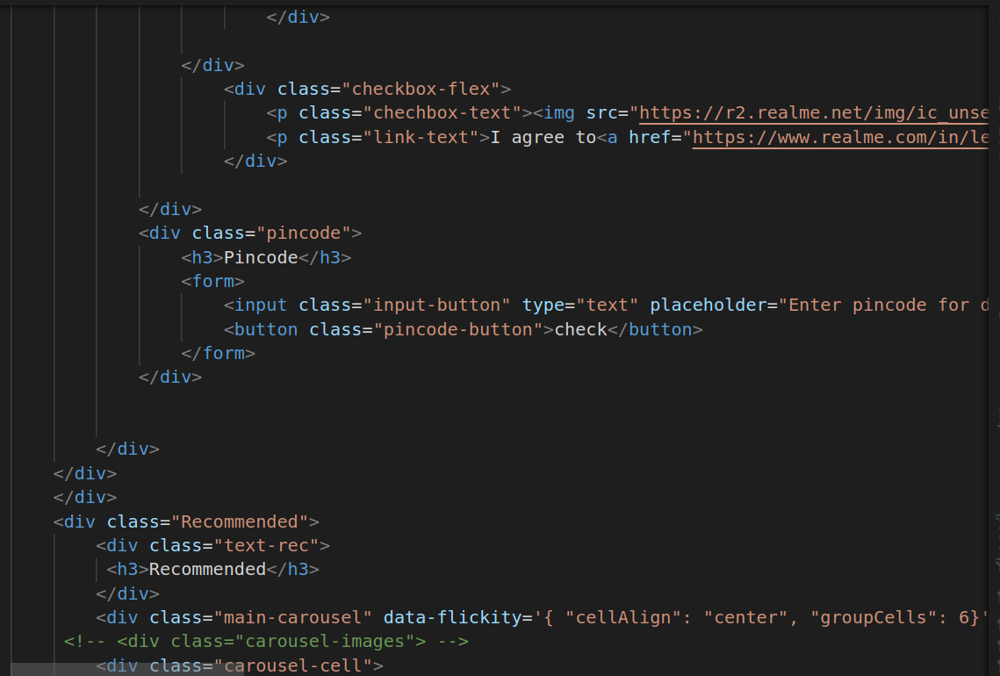

* div: The div element is a container for grouping and styling other HTML elements. It's often used for layout purposes and doesn't have any specific semantic meaning.
* id="app" class="goods": This is an opening div tag with two attributes: id and class. The id attribute uniquely identifies an element, and the class attribute is used to apply CSS styles or target the element with JavaScript.
* div class="goods-navbar": This is another div element with the class "goods-navbar" used to create a navigation bar.
*nul class="nav-items": This is an unordered list with the class "nav-items" used for creating a list of navigation items.
* li class="item1", li class="item2", li class="item3": These are list items with different classes used as individual navigation items.
* a href: This is an anchor element used to create hyperlinks. The href attribute specifies the URL the link points to.
* hr: This is a horizontal rule used to create a thematic break or horizontal line.
* div class="first-div": Another div element with the class "first-div" used for grouping content.
* img: The img element is used to display images. It has attributes like src for the image source, width for the image width, and height for the image height.
* ul class="side-images": Another unordered list used for displaying a list of smaller images, presumably for image thumbnails.
* button: The button element creates a clickable button. In this case, it's used for "New" and "Earn Coins" buttons.
* ul class="unordered-list": An unordered list used for displaying a list of items, presumably features or offers related to the product.
* p: The p element is used for defining paragraphs of text.
* h3: The h3 element represents a level 3 heading, often used for subheadings.
* span: The span element is an inline container often used to apply styles or manipulate small portions of text within a larger block of content.
* form: The form element is used to create a form for user input. It can contain input fields, buttons, and other form elements.
* input: The input element is used for creating form input fields, such as text input, checkboxes, or radio buttons.
* div class="Recommended": Another div element with the class "Recommended" for grouping recommended products.
* div class="main-carousel" data-flickity='{ "cellAlign": "center", "groupCells": 6}': This div>element with the class "main-carousel" is likely used for creating a carousel or slider of recommended products. The data-flickity attribute appears to be used for configuration.
* div class="text-nav": This div element groups text navigation links.
* div class="second-div": Another div element with the class "second-div" used for grouping content.
* img src="...": Several img elements used to display images, likely related to the product.
* div class="service-devision": This div element groups content related to services.
* div class="servicecard sp1", div class="servicecard sp2", ...: These are div elements with classes used to display information about different services.
* div class="footer-section": This div element groups content related to the website's footer.
* div class="fotter-menu": These div elements are used to create different sections of the footer, such as "Recommended," "Support," "About realme," and "Contact realme."
* ul class="menu-list": Unordered lists are used within the footer sections to list various items.
* li: List items are used within the footer lists to represent individual items or links.

10.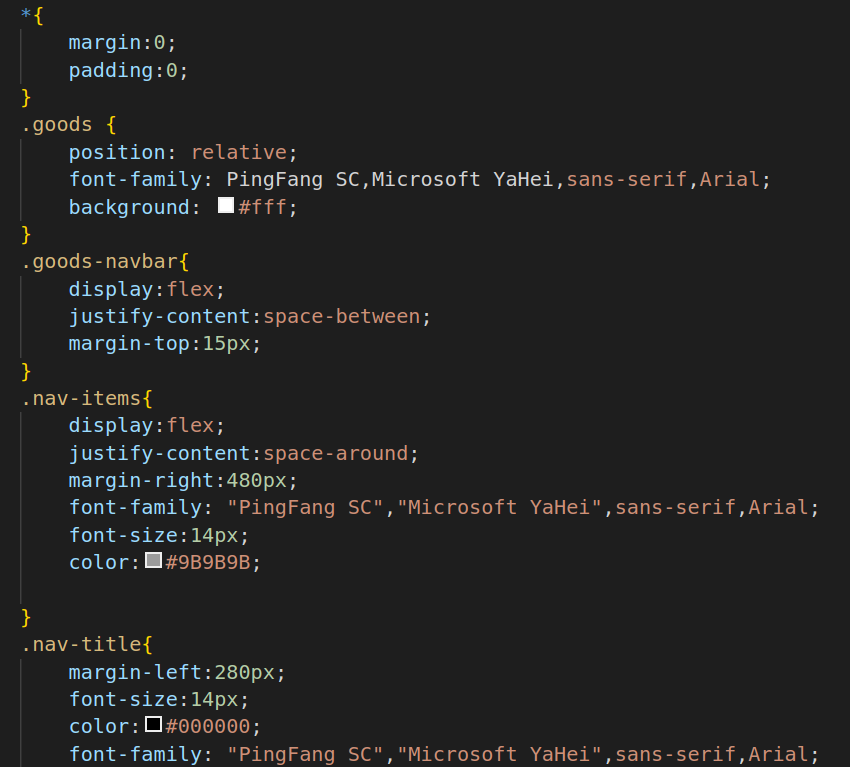

11.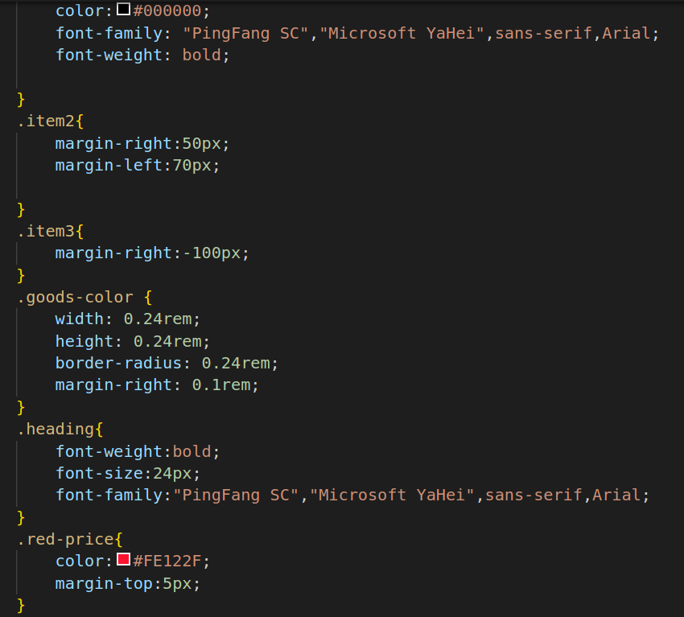

12.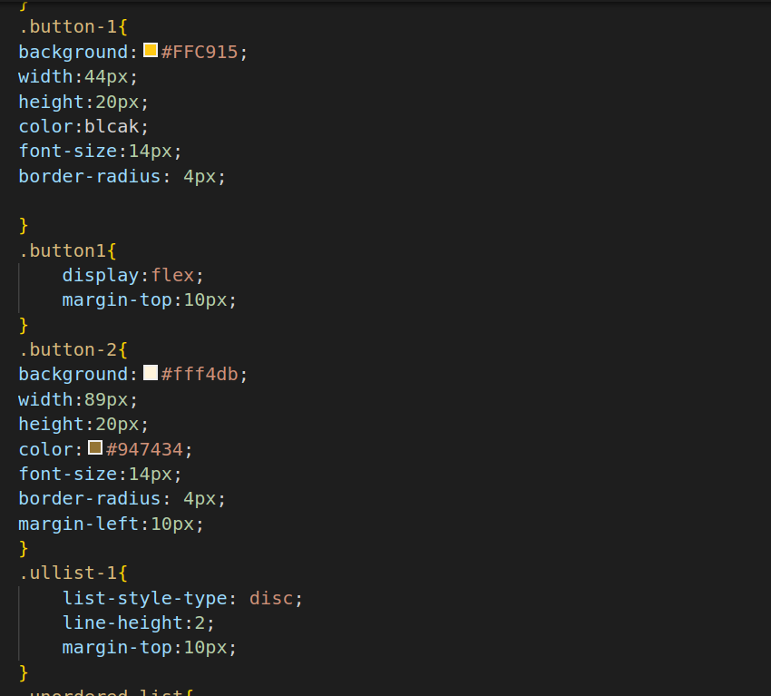

13.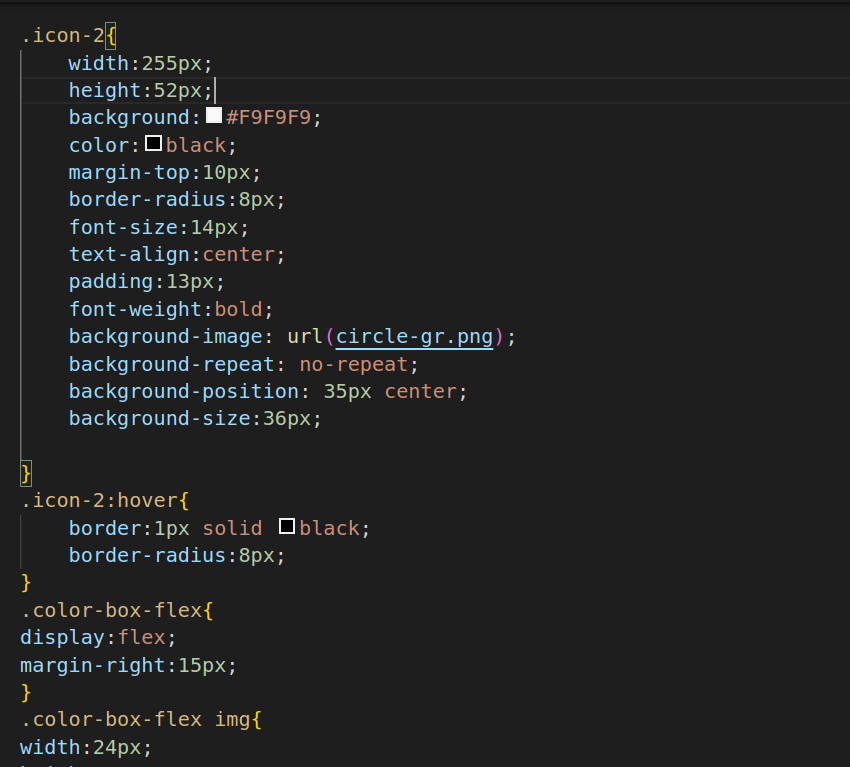

* The * selector targets all elements on the page.
margin and padding are set to 0, which resets the default margin and padding for all elements. This is often used to create consistent spacing and layout throughout the page.
* .goods is a class selector targeting an element with the class of "goods."
* position: relative; sets the position property to "relative," which means the element's position is relative to its normal position in the document flow.
font-family specifies the font family for text within this element.
background sets the background color to white (#fff).
css
* .goods-navbar is a class selector targeting an element with the class of "goods-navbar."
display: flex; turns the element into a flex container, allowing you to use flex properties.
* justify-content: space-between; aligns the flex items (inside the container) along the main axis with space distributed evenly between them.
* margin-top: 15px; adds a top margin of 15 pixels to create some space between this element and the one above it.
* nav-items is a class selector targeting an element with the class of "nav-items."
* display: flex; makes this element a flex container, similar to .goods-navbar.
* justify-content: space-around; distributes space evenly between the flex items with equal space around them.
* margin-right: 480px; adds right margin to the element, pushing it away from the right edge.
font-family specifies the font family for text within this element.
font-size sets the font size to 14 pixels.
color sets the text color to a shade of gray (#9B9B9B).
* .nav-title is a class selector targeting an element with the class of "nav-title."
* margin-left: 280px; adds a left margin of 280 pixels, creating space on the left side of the element.
font-size sets the font size to 14 pixels.
color sets the text color to black (#000000).
font-family specifies the font family for text within this element.
font-weight: bold; makes the text bold.
* .item2 and .item3 are class selectors targeting specific elements with the classes "item2" and "item3."
margin-right and margin-left properties adjust the margins of these elements to control their spacing.
* .goods-color is a class selector targeting an element with the class of "goods-color."
width and height set the dimensions of the element to 0.24rem, creating a square element.
border-radius rounds the corners of the element to create a circular shape with a radius of 0.24rem.
margin-right: 0.1rem; adds a right margin of 0.1rem to create space between this element and adjacent elements.
* heading is a class selector targeting an element with the class of "heading."
font-weight: bold; makes the text bold.
font-size: 24px; sets the font size to 24 pixels.
font-family specifies the font family for text within this element.
* .red-price is a class selector targeting an element with the class of "red-price."
* color: #FE122F; sets the text color to a shade of red (#FE122F).
* margin-top: 5px; adds a top margin of 5 pixels to create space between this element and the one above it.
* .button-1 is a class selector targeting an element with the class of "button-1."
background: #FFC915; sets the background color to a shade of yellow (#FFC915).
width and height define the dimensions of the button.
* color: black; sets the text color to black.
* font-size: 14px; sets the font size to 14 pixels.
* border-radius: 4px; rounds the corners of the button with a radius of 4 pixels.
* .button1 is a class selector targeting an element with the class of "button1."
* display: flex; makes this element a flex container, allowing its child elements to be flex items.
* margin-top: 10px; adds a top margin of 10 pixels to create space between this element and the one above it.
* .button-2 is a class selector targeting an element with the class of "button-2."
background: #fff4db; sets the background color to a pale yellow shade (#fff4db).
width and height define the dimensions of the button.
* color: #947434; sets the text color to a specific shade of green (#947434).
font-size: 14px; sets the font size to 14 pixels.
* border-radius: 4px; rounds the corners of the button with a radius of 4 pixels.
* margin-left: 10px; adds a left margin of 10 pixels to create space between this element and the one to its left.
* .ullist-1 is a class selector targeting an unordered list (<ul>) with the class of "ullist-1."
list-style-type: disc; sets the list item marker style to filled circles (disc).
* line-height: 2; controls the spacing between lines within the list items.
* margin-top: 10px; adds a top margin of 10 pixels to create space between this list and the elements above it.
* .icon-1 is a class selector targeting an element with the class of "icon-1."
width and height define the dimensions of the element.
border: 1px solid black; sets a solid black border with a 1-pixel width around the element.
* color: black; sets the text color to black.
* margin-top: 10px; adds a top margin of 10 pixels to create space between this element and the one above it.
* border-radius: 8px; rounds the corners of the element with an 8-pixel radius.
* font-size: 14px; sets the font size to 14 pixels.
* margin-right: 25px; adds a right margin of 25 pixels to create space between this element and the one to its right.
* text-align: center; horizontally centers the text within the element.
* padding: 13px; adds internal padding of 13 pixels to the element.
* font-weight: bold; makes the text bold.
background-image: url(circle-lg.png); sets a background image for the element.
* background-repeat: no-repeat; prevents the background image from repeating.
* background-position: 35px center; positions the background image 35 pixels from the left and centers it vertically.
* .icon-2 is a class selector targeting an element with the class of "icon-2."
width and height define the dimensions of the element.
* background: #F9F9F9; sets the background color to a shade of gray (#F9F9F9).
* color: black; sets the text color to black.
* margin-top: 10px; adds a top margin of 10 pixels to create space between this element and the one above it.
* border-radius: 8px; rounds the corners of the element with an 8-pixel radius.
* font-size: 14px; sets the font size to 14 pixels.
* text-align: center; horizontally centers the text within the element.
* padding: 13px; adds internal padding of 13 pixels to the element.
* font-weight: bold; makes the text bold.
* background-image: url(circle-gr.png); sets a background image for the element.
* background-repeat: no-repeat; prevents the background image from repeating.
* background-position: 35px center; positions the background image 35 pixels from the left and centers it vertically.
* background-size: 36px; sets the size of the background image.
* .color-box-flex is a class selector targeting an element with the class of "color-box-flex."
* display: flex; makes this element a flex container, allowing its child elements to be flex items.
* margin-right: 15px; adds a right margin of 15 pixels to create space between this element and the one to its right.
* This is a pseudo-element selector targeting the scrollbar within elements with the class "details-part."
::-webkit-scrollbar is a vendor-prefixed selector for styling the scrollbar in WebKit-based browsers.
* display: none; hides the scrollbar, making it invisible to the user.

14.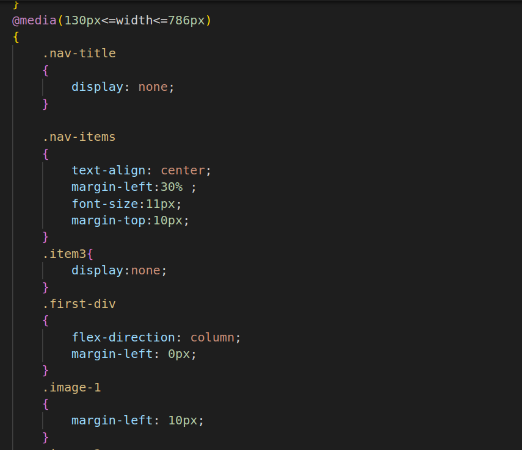

15.[css](s29.png)

16.[css](s30.png)

* @media (130px <= width <= 786px) is a media query that targets screen widths within the specified range.
* .nav-title is a class selector targeting elements with the class "nav-title."
* display: none; hides the element with this class, making it invisible on the webpage. In this case, it appears that the "nav-title" is hidden under certain conditions, likely as part of responsive design.
.nav-items is a class selector targeting elements with the class "nav-items."
* text-align: center; centers the text within the element horizontally.
* margin-left: 30%; adds a left margin of 30% of the container's width. This centers the navigation items horizontally within their container.
* font-size: 11px; sets the font size of the text within this element to 11 pixels.
* margin-top: 10px; adds a top margin of 10 pixels. This space may be added between the navigation items and the content above them.
.item3 is a class selector targeting elements with the class "item3."
* display: none; hides the element with this class. Similar to .nav-title, it hides an item under certain conditions.
* main-carousel is a class selector targeting elements with the class "main-carousel."

flex-wrap: wrap; allows flex items to wrap to the next line if they exceed the container's width. In this context, it seems to control the layout of carousel items.
overflow: hidden; hides any content that overflows the container. This can be useful when you want to clip or hide content that exceeds the container's boundaries.
margin-left: 10px; adds a left margin of 10 pixels to this element.
.carousel-cell is a class selector targeting elements with the class "carousel-cell."
* flex-direction: column; changes the direction of the flex container to a column layout, which means child elements will be stacked vertically within the container. This is often used for vertical alignment of items.
.images-card is a class selector targeting elements with the class "images-card."
* width: fit-content; sets the width of this element to fit its content. It allows the element to expand or shrink to fit the content within it.
* margin-left: 10px; adds a left margin of 10 pixels to this element.
* t-1 is a class selector targeting elements with the class "t-1."
* margin-left: -250px; shifts the element to the left by 250 pixels. This can be used for hiding content off-screen.
* font-weight: 800; sets the font weight of the text within this element to 800, which is typically a bold font weight.
* t-2 is a class selector targeting elements with the class "t-2."
* display: none; hides the element with this class. This is a common technique for hiding elements under certain conditions, often used for responsive design.
* footer is a class selector targeting the footer element.
* width: 100%; sets the width of the footer to 100% of its parent container.
* height: 100px; sets the height of the footer to 100 pixels.
* background: white; sets the background color of the footer to white.
* position: fixed; fixes the footer's position on the screen.
* bottom: 0px; positions the footer at the bottom of the viewport.
* fixed-header is a class selector targeting elements with the class "fixed-header."
* margin-top: 10px; adds a top margin of 10 pixels to this element.
* margin-bottom: 30px; adds a bottom margin of 30 pixels.
* width: 100%; sets the width of this element to 100%.
* height: 50px; sets the height to 50 pixels.
* background: white; sets the background color to white.
* position: sticky; makes the element sticky, so it sticks to the top of the viewport when scrolling.
overflow: hidden; hides any content that overflows this element.
* top: 0; positions the element at the top of its containing block.
* bottom: 0; positions the element at the bottom of its containing block.
* z-index: 1; sets the z-index to 1, controlling the stacking order of elements.
* Header-plus is a class selector targeting elements with the class "Header-plus."
* position: relative; positions the element relative to its normal position.
* z-index: 1000; sets the z-index to 1000, making it appear above other elements.

# MY LEARNINGS

* Intially I dont know how to create carousel
* Actually it has to be done with javascript but as of now i have learned html and css so i faced difficulties while creating carousel but i have explored some websites and created carousel sucessfully.
* And i have learned making page responsive ,making header sticky .
